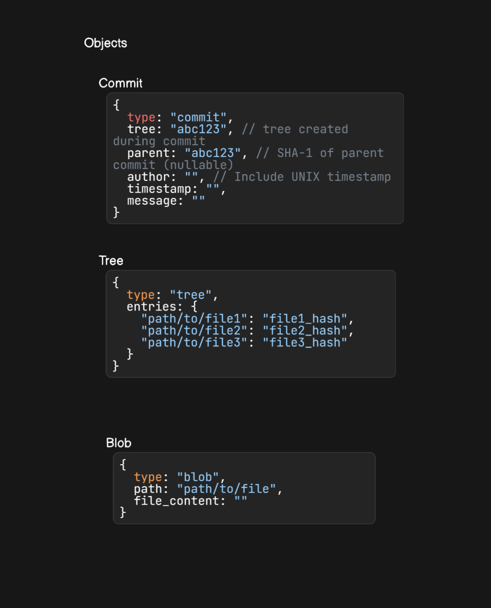

<h1>Fuata - A Custom Version Control System</h1>

  Fuata is a simple, custom version control system inspired by Git. The primary goal of Fuata is to manage changes
  to files and directories by creating and maintaining a history of changes, including stages for added files, committed
  changes and viewing the history through logs. The tool is command-line based, similar to how Git is used, and
  provides basic version control functionalities such as adding files, committing changes and viewing
  logs.

<h2>Table of Contents</h2>
<ul>
  <li><a href="#overview">Overview</a>
    <ul>
      <li><a href="tools-used">Tools Used</a></li>
    </ul>
  </li>
  <li><a href="command-line-usage">Command-Line Usage</a></li>
  <li><a href="internal-architecture">Internal Architecture</a>
    <ul>
      <li><a href="high-level-view-of-the-system"/>High Level View of the System</a></li>
      <li><a href="directed-acyclic-graph-_DAG_-objects"/>Directed Acyclic Graph (DAG) Objects</a></li>
      <li><a href="hashing-and-compression"/>Hashing and Compression</a></li>
      <li><a href="staging"/>Staging</a></li>
      <li><a href="tree-construction"/>Tree Construction</a></li>
    </ul>
  </li>
  <li><a href="how-it-works">How It Works</a>
    <ul>
      <li><a href="initialising-a-fuata-repository"/>Initialising a Fuata Repository</a></li>
      <li><a href="staging-a-file"/>Staging a File</a></li>
      <li><a href="committing-a-file"/>Committing a File</a></li>
      <li><a href="logging-commit-history"/>Logging Commit History</a></li>
      <li><a href="diffing"/>Diffing</a></li>
    </ul>
  </li>
  <li><a href="file-structure">File Structure</a></li>
  <li><a href="current-limitiations-and-future-work">Current Limitations and Future Work</a></li>
</ul>

## Overview

  Fuata operates on a simple set of commands:
  <ul>
    <li>
      <code>fuata add &lt;file_name&gt;</code>: Stages the given file, marking it for the next commit
    </li>
    <li>
      <code>fuata commit &lt;message&gt;</code>: Commits the staged changes with a message, creating a new snapshot of the project
    </li>
    <li>
      <code>fuata log</code>: Displays a log of all previous commits, showing the commit history
    </li>
  </ul>
  Each file is tracked with a hash, representing its content. Changes are tracked at the file level, and directories
  are represented as trees, where the tree's nodes point to file hashes or other subdirectories (subtrees).

### Tools Used

  <ul>
    <li>Fuata has been written in <code>Kotlin</code></li>
    <li><code>IntelliJ IDE</code> for development</li>
    <li><code>Git</code> for version control...😆😆 (C'mon, cut me some slack)</li>
  </ul>

## Command-Line Usage

// Todo

## Internal Architecture

  Fuata takes advantage of two main concepts:
  <ul>
    <li><code>Hashing</code> for Content-Addressable Storage (CAS file system)</li>
    <li>A <code>Directed Acyclic Graph (DAG)</code> data structure to represent the entire version contol system</li>
  </ul>

### High Level Diagram of the System

  
  

    In the diagram above, you can see a visual representation of the DAG with its different types of nodes: Blob, Tree and Commit objects.
    The commits are the top references. They point to other commits as well as the root tree created during the creation of a commit. The tree represents
    a directory or subdirectories and they can point to blobs. A blob represents a file. The most recent commit is pointed to by the HEAD; a symbolic link
    to a file in refs folder, that holds the actual hash of the commit.
  

  
  

    The diagram above shows the data that each of the three DAG node types holds.
  

### Directed Acyclic Graph (DAG) Objects

  Fuata operates using an object-based model where each node in the DAG can either be a <code>Blob</code>, <code>Tree</code> or
  <code>Commit</code> object.
  <ol>
    <li><code>Blob</code></li>
    

      Each file in Fuata is tracked by its content hash. This hash serves as a unique identifierfor the file's content. When a file is created, its content is taken
      and used to create a hash using the SHA-1 algorithm. A new file, with the hash as its filename, is created in the <code>objects</code> folder of the repository
      proper. The content of the file in working directory is then taken, serialised, and compressed into a <code>ByteArray</code>. This byte array forms the <Blob>. This blob
        is then taken and written to the object file. When a file changes, a new hash is generated and the file is re-staged. Even a single character
      change will result in a new hash from the SHA-1 algotrithm.
    

    <li><code>Tree</code></li>
    

      A directory is represented as a tree in Fuata. Each tree object contains references to other trees (subdirectories) or files
      (by their hashes). These tree objects form a hierarchical structure that mirrors the file system's directory structure.
      Additionally, a tree object (a root tree) is created when creating a new commit, and references all directories and files
      present in the working directory at that specific time.
    

    <li><code>Commits</code></li>
    

      A commit contains the current state of the repository, including references to the root tree and metadata like the commit message and 
      timestamp. Each commit is associated with a unique hash. A new commit will reference the root tree created during a commit operation and also the parent commit (the
      immediate former commit being pointed to by 
    

  </ol>

### Hashing and Compression

  Fuata uses the <code>SHA-1</code> hashing algorithm that takes a String type and returns a 40-digit hexadecimal value as a String.
  For compression, Kotlin's internal libraries are used. Specifically, the <code>Deflater</code> and <code>Inflater</code> classes and their methods
  are used to decompress and compress items, respectivelly. The output of this compression is a ByteArray, while decompression reverts it to its original
  string. This compressed data is what is written in files within the objects folder (object files). This is crucial in minimising the space taken by these object
  files, making Fuata more efficient.

### Staging

  When staging a file that exists in the working directory, Fuata takes the file and creates a Blob which is stored in the objects folder with the hash of the file
  content as the object file filename. The details of the file are also added to an index file within the repository proper. The index file stores information as a JSON
  string where it is a JSON array of JSON objects. Each object includes the <code>path</code> (actual file path in the working directory) and the <code>hash</code>
  generated from the file content.
  The content within the index file will look like this:
  <pre>
    <code>
      [
        {
          path: "src/kotlin/main.kt",
          hash: "abc123...7x8y9z"
        },
        {
          path: "src/kotlin/models/Blob.kt",
          hash: "uio567...1j2k3l"
        }
      ]
    </code>
  </pre>

### Tree Construction

  A tree object is created to represent a directory. This tree has a list of entries that point to blobs of files existing within that directory.
  Subsequently, a tree object is also created during the commiting process. A root tree that points to all subtrees or blobs present at a particular
  moment, representing the state of the working directory.

## How It Works
### Intialising a Fuata Repository

// TODO

### Staging a File

// TODO

### Committing a File

// TODO

### Logging Commit History

// TODO

### Diffing

// TODO

## File Structure

## Current Limitations and Future Work
